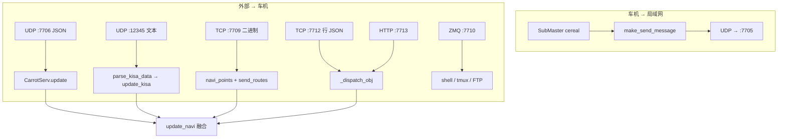

# CarrotPilot 服务代码逆向分析报告（按端口细化）

> **分析范围**：`carrotcode/carrot/` 目录内 Python 实现（与上游 openpilot `selfdrive/carrot/` 对应快照）。  
> **核心进程**：`carrot_man.py` → `CarrotMan` + `main()`；导航/融合状态：**`carrot_serv.py` → `CarrotServ`**。  
> **行号**：以本仓库当前文件为准。

---

## 1. 模块职责概览

| 模块 | 职责 |
|------|------|
| `carrot_man.py` | 多线程网络服务：7705 广播、7706 收 JSON、12345 KISA、7709 二进制路线、7710 ZMQ 命令、7712 TCP 导航行、7713 HTTP 导航；订阅 cereal 并发布 `carrotMan` / `navRoute` 等 |
| `carrot_serv.py` | `update()` / `update_kisa()` / `update_navi()`：解析外部数据，维护 `active_carrot`、TBT/SDI/GPS 等内部状态 |
| `xiaoge_data.py` | **TCP 7711**：车机向客户端推送「小哥」JSON 帧（与 `CarrotMan` 并行进程，非 `main()` 内启动） |
| `carrot_server.py` | **HTTP 默认 7000**：aiohttp 静态/Web 设置（`--port` 可改） |
| `recovery/server.py` | **TCP 默认 6999**：恢复/辅助服务（独立入口，非 `CarrotMan`） |

---

## 2. `CarrotMan` 进程与线程模型

| 线程/循环 | 函数 | 端口/协议 |
|-----------|------|-----------|
| 守护线程 | `broadcast_version_info` | **UDP 7705** 发送 |
| 守护线程 | `carrot_cmd_zmq` | **ZMQ tcp://\*:7710**（REP） |
| 守护线程 | `carrot_panda_debug` | 无端口 |
| 守护线程 | `carrot_route` | **TCP 7709** 监听 |
| `main()` 启动 | `kisa_app_thread` | **UDP 12345** |
| `main()` 启动 | `carrot_navi_thread` → `carrot_navi_tcp_server` | **TCP 7712** |
| `main()` 启动 | `carrot_navi_http_thread` | **TCP 7713**（aiohttp） |
| `main()` 阻塞循环 | `carrot_man_thread` | **UDP 7706** |

---

## 3. 数据流总览（Mermaid）

---

## 4. 按端口的协议与字段（核心）

### 端口一览（本目录相关）

| 端口 | 协议 | 绑定地址 | 方向 | 实现文件 |
|------|------|----------|------|----------|
| **7705** | UDP | 不 bind；`sendto` 目标为广播 IP 或 `remote_addr[0]` | 车机 → 外网 | `carrot_man.py` |
| **7706** | UDP | `0.0.0.0` | 外 → 车机 | `carrot_man.py` |
| **12345** | UDP | `''`（全接口） | 外 → 车机 | `carrot_man.py` |
| **7709** | TCP | `0.0.0.0` | 外 → 车机 | `carrot_man.py` |
| **7710** | ZMQ REP over TCP | `*` | 外 → 车机（请求-应答） | `carrot_man.py` |
| **7711** | TCP | `0.0.0.0` | 车机 → 客户端（带长度前缀的 JSON） | `xiaoge_data.py` |
| **7712** | TCP | `0.0.0.0` | 外 → 车机 | `carrot_man.py` |
| **7713** | HTTP/1.1 | `0.0.0.0` | 外 → 车机 | `carrot_man.py` |
| **7000** | HTTP（默认） | `0.0.0.0`（可参改） | Web | `carrot_server.py` |
| **6999** | TCP（默认） | 可参改 | 恢复服务 | `recovery/server.py` |

---

### 4.1 UDP **7705** — 状态广播（出站）

| 属性 | 值 |
|------|-----|
| **数据类型** | `str`：`json.dumps(msg)` 后 **UTF-8 字节** |
| **频率** | `Ratekeeper(20)` → **20 Hz**（约每 50 ms） |
| **套接字** | `SOCK_DGRAM` + `SO_BROADCAST=1` |
| **目标** | `broadcast_ip = get_broadcast_address()`（`br0`/`wlan0`）；若 `self.remote_addr` 非空则改为对端 IP，仍发往 **端口 7705**（与接收方约定一致） |

**JSON 根对象字段（`make_send_message`，全为 JSON 原生类型）**：

| 字段名 | JSON 类型 | 含义 | 数据来源（摘要） |
|--------|-----------|------|------------------|
| `Carrot2` | string / null | 版本 | `Params.get("Version")` |
| `IsOnroad` | boolean | 是否在路 | `Params.get_bool("IsOnroad")` |
| `CarrotRouteActive` | boolean | 外部/导航路线是否激活 | `self.navi_points_active` |
| `ip` | string | 本机展示 IP | `get_local_ip()` 或 hostname 解析 |
| `port` | number | 回连端口提示 | 常量 **`7706`**（`self.carrot_man_port`） |
| `log_carrot` | string | 车端日志片段 | `carState.logCarrot`（onroad） |
| `v_cruise_kph` | number | 巡航设定 | `carState.vCruise` |
| `carcruiseSpeed` | number | 巡航速度（km/h 量级） | `cruiseState.speed * 3.6` |
| `v_ego_kph` | number（int 化） | 表显车速 km/h | `int(vEgoCluster*3.6+0.5)` |
| `tbt_dist` | number | 转弯距离相关 | `carrot_serv.xDistToTurn` |
| `sdi_dist` | number | 限速/提示距离 | `carrot_serv.xSpdDist` |
| `active` | boolean | OP 纵向控制是否激活 | `selfdriveState.active` |
| `xState` | number | 纵向规划状态 | `longitudinalPlan.xState` |
| `trafficState` | number | 交通灯相关状态 | `longitudinalPlan.trafficState` |

**副作用（非 7705 载荷）**：约每 20 帧或存在 `remote_addr` 时更新 `NetworkAddress`（`params_memory`）、`save_toggle_values()`；无 `navd` 时可能清空 `navi_points`。

---

### 4.2 UDP **7706** — 手机 / 外部 → `CarrotServ.update`

| 属性 | 值 |
|------|-----|
| **数据类型** | **UTF-8 JSON 对象**（`recvfrom` 最大 4096 字节 → `json.loads`） |
| **超时** | `sock.settimeout(10)`；超时则 `remote_addr = None` |
| **处理** | `CarrotServ.update(json_obj)` |

#### 4.2.1 分支逻辑（必读）

| 条件 | 行为 |
|------|------|
| `"carrotIndex" in json` | `self.carrotIndex = int(json.get("carrotIndex") or self.carrotIndex + 1)` |
| `carrotIndex % 60 == 0` 且含 `"epochTime"` | 非 PC 时 `set_time(int(epoch), timezone_remote)` |
| `"carrotCmd" in json` | 记录 `carrotCmd` / `carrotArg`，`carrotCmdIndex = carrotIndex` |
| **任意包** | `self.active_count = 80` |
| `"goalPosX"` 且 `goalPosY` 非空 | `goalPosX/Y` → **float**；`szGoalName` 原样 |
| **`"nRoadLimitSpeed" in json`** | 进入**主导航块**（限速 + 全部 SDI/TBT/导航点字段 + `_update_tbt()` + `_update_sdi()`） |
| `"latitude" in json` | **手机 GPS 块**：更新 `phone_*`、`heading`；若 **>3s** 无导航点更新则用纬度/经度覆盖 `vpPosPointLatNavi/LonNavi`，`nPosSpeed = float(gps_speed)` |

> 说明：客户端若始终带上键 **`nRoadLimitSpeed`**（即使为 0），则会反复走主导航块；若仅发 `latitude` 等，则主块不执行（`else: pass`），仅走手机 GPS 块。

#### 4.2.2 `nRoadLimitSpeed` 主块内字段 — 类型与 Python 侧变量

| JSON 键 | 读取方式 | Python 内部类型 | 备注 |
|---------|----------|-----------------|------|
| `nRoadLimitSpeed` | `int(...)`，再经 >200、==120 等修正 | int | 与历史计数器比较后才写入 `self.nRoadLimitSpeed` |
| `nSdiType` | `_i(..., -1)` | int | |
| `nSdiSpeedLimit` | `_i(..., 0)` | int | |
| `nSdiSection` | `_i(..., -1)` | int | |
| `nSdiDist` | `_i(..., -1)` | int | |
| `nSdiBlockType` | `_i(..., -1)` | int | |
| `nSdiBlockSpeed` | `_i(..., 0)` | int | |
| `nSdiBlockDist` | `_i(..., 0)` | int | |
| `nSdiPlusType` ~ `nSdiPlusBlockDist` | 同上 `_i` | int | Plus 六元组 |
| `roadcate` | `_i(..., 0)` | int | |
| `nTBTDist` | `int(...)` | int | |
| `nTBTTurnType` | `int(...)` | int | |
| `szTBTMainText` | `_s(...)` | str | |
| `szNearDirName` | `_s(...)` | str | |
| `szFarDirName` | `_s(...)` | str | |
| `nTBTNextRoadWidth` | `int(...)` | int | |
| `nTBTDistNext` | `int(...)` | int | |
| `nTBTTurnTypeNext` | `int(...)` | int | |
| `szTBTMainTextNext`（逻辑字段名） | `json.get(...)` | str | **逆向注意**：源码写为 `json.get("szTBTMainText", "")` 赋给 `szTBTMainTextNext`，即误用键名 **`szTBTMainText`**；客户端若只发 `szTBTMainTextNext` 字符串则**不会**写入下一诱导主文案。 |
| `nGoPosDist` | `int(...)` | int | |
| `nGoPosTime` | `int(...)` | int | |
| `szPosRoadName` | `_s(...)`；`"null"` → 清空 | str | |
| `vpPosPointLat` / `vpPosPointLon` | `float(...)` | float | 非 0 时刷新 `last_update_gps_time_navi` |
| `nPosAngle` | `float(...)` | float | 依赖 vp 非 0 分支内 |
| `nPosSpeed` | `float(...)` | float | |

#### 4.2.3 手机 GPS 块字段

| JSON 键 | 读取 | 作用 |
|---------|------|------|
| `heading` | `_f` | `nPosAnglePhone` |
| `latitude` / `longitude` | `_f` | `phone_latitude/longitude` |
| `accuracy` | `_f` | `phone_gps_accuracy`；<15 时 `phone_gps_frame++` |
| `gps_speed` | `float` | 回退为导航速度 |

**`7706` 副作用**：首次收到数据会 `self.remote_addr = remote_addr`，影响 **7705** 单播目标。

---

### 4.3 UDP **12345** — KISA / Waze 风格键值串

| 属性 | 值 |
|------|-----|
| **数据类型** | **UTF-8 文本**（非 JSON） |
| **语法** | `段1/段2/...`；每段 `key:value`（**仅第一个 `:`** 分割） |
| **值类型** | `parse_kisa_data`：可 `int(value)` 则 **int**，否则 **str** |

**`update_kisa` 已处理键（`carrot_serv.py`）**：

| 键 | 值类型 | 效果 |
|----|--------|------|
| `kisawazecurrentspd` | 任意 | 占位（`pass`） |
| `kisawazeroadspdlimit` | int（可 str 转） | >0 时写 `nRoadLimitSpeed`（英制会换算） |
| `kisawazealert` / `kisawazeendalert` | 任意 | 占位 |
| `kisawazeroadname` | str | `szPosRoadName` |
| `kisawazereportid` + `kisawazealertdist` | str | 解析距离数字；`camera`/`police` → `xSpdType` 101/100，`xSpdDist`、`xSpdLimit` |

**计数器**：`active_kisa_count = 100`，在 `update_navi` 中影响 `active_carrot` 优先级。

---

### 4.4 TCP **7709** — 二进制批量路径（单次连接）

| 属性 | 值 |
|------|-----|
| **字节序** | 网络序（big-endian） |
| **帧结构** | **`[4 byte uint32 total_size][total_size bytes payload]`** |
| **payload 布局** | 每 **8 字节** 一组：`struct.unpack('!ff', ...)` → **float32 经度 x、float32 纬度 y**（与变量名一致：先 lon 后 lat） |

**处理流水线**：

1. `total_size` 必须与 `len(all_data)` 一致读完。  
2. 每点追加到 `self.navi_points` 为 `(x, y)` 元组（即 lon, lat）。  
3. `Coordinate.from_mapbox_tuple((x, y))` → `coords` 列表元素为 `{"latitude","longitude"}`。  
4. `send_routes(coords)` 发 cereal `navRoute`；终点写入 `NavDestination`，`place_name="External Navi"`。

**注意**：`receive_double`（`!d`）在本文件中存在，但 **7709 路径未使用**。

---

### 4.5 ZMQ **7710**（底层 TCP）— 调试 / 上传

| 属性 | 值 |
|------|-----|
| **模式** | `zmq.REP`；`bind("tcp://*:7710")` |
| **轮询** | `zmq.Poller`，`poll(100)` ms |
| **请求体** | **UTF-8 JSON 对象**（`socket.recv` → `json.loads`） |

| JSON 键 | 类型期望 | 服务端行为 | 响应体 |
|---------|----------|------------|--------|
| `echo_cmd` | string | `subprocess.run(..., shell=True)` | JSON：`echo_cmd`, `exitStatus`, `result`, `error`（stdout/stderr 文本，编码失败时 `euc-kr` ignore） |
| `tmux_send` | string（作 FTP 密码字段传入） | `make_tmux_data` + `send_tmux` + `send_tmux_http` | JSON：`tmux_send`, `result: "success"` |

**空闲时逻辑**（无 JSON 请求）：根据 `IsOnroad` 累加 `isOnroadCount`；约 500 拍后抓 tmux 并 FTP/HTTP 上传；`CarrotException` ∈ `{exception, log, tmux_send}` 时也会上传。

**安全**：`echo_cmd` = **远程 shell**，等同高危后门，仅限可信网段。

---

### 4.6 TCP **7712** — 导航 JSON 行流

| 属性 | 值 |
|------|-----|
| **连接** | `accept` 后 `makefile("r", encoding="utf-8")` |
| **记录格式** | **一行一个 JSON**（`readline` → `strip` → `json.loads`） |
| **解析失败** | 整行作为非 dict 传入 `_dispatch_obj` → 可能 `handle_unknown` |

#### 4.6.1 顶层 JSON 对象（可多键并存）

| 键 | 值类型 | 处理 |
|----|--------|------|
| `vrtx` | **array** of **object** | `handle_route`：见下 |
| `rgdata` | **object** | 若顶层 **`timestamp_ms`** 非陈旧 → `CarrotServ.update(rgdata)` |
| `sinf` | **object** | `handle_traffic_light` |

**`timestamp_ms` 位置**：与 `rgdata` **同级**顶层键（`_get_timestamp_ms(obj)`），用于 `_is_stale_rgdata` 去重。

#### 4.6.2 `vrtx` 数组元素（`handle_route`）

| 字段 | 类型 | 必填 | 含义 |
|------|------|------|------|
| `valid` | boolean | 否 | 默认 `true`；`false` 则过滤掉 |
| `x` | number → float | 是 | **经度** |
| `y` | number → float | 是 | **纬度** |

空数组 → 清空路线、`navi_points_active=False`。

#### 4.6.3 `sinf` 对象（红绿灯 → `params_memory`）

| 字段 | 类型 | 含义 |
|------|------|------|
| `redLightOn` / `leftLightOn` / `greenLightOn` / `rightLightOn` / `uturnLightOn` | truthy | 灯色优先级：红 > 左 > 绿 > 右 > uturn |
| `*RemainTime` | number | 各灯倒计时秒 |
| `distance` | number | 到灯距离（米） |

**写出**：`TrafficLight` = JSON 字符串 `{"distance": int, "lamp": "red"\|"left"\|..., "remain": int}`。

---

### 4.7 HTTP **7713** — aiohttp 导航 API

| 路由 | 方法 | 请求体 | 响应 |
|------|------|--------|------|
| `/api/navi/{tmap_version}` | POST | **application/json** 解析为 **dict** | 200：`{"ok": true, "tmap_version": "<路径参数>"}` |
| `/health` | GET | 无 | 200：`{"ok": true, "service": "carrot_navi_http"}` |

**POST 处理**：

1. `await request.json()` → `obj`。  
2. 若为 dict，注入 **`obj["_tmap_version"] = tmap_version`**（字符串）。  
3. `self._dispatch_obj(obj)` — **与 7712 行 JSON 完全同一套** `vrtx` / `rgdata` / `sinf`。  
4. JSON 解析失败 → 400 + `ok:false`；分发异常 → 500。

**限制**：`client_max_size = 1_048_576`（1MB）。

---

### 4.8 TCP **7711** — `XiaogeDataBroadcaster`（`xiaoge_data.py`）

| 属性 | 值 |
|------|-----|
| **方向** | 车机 **→** 已连接客户端（可多客户端） |
| **绑定** | `0.0.0.0:7711` |
| **下行帧** | **`struct.pack('!I', len)` + UTF-8 JSON bytes**（与 7709 相同的「4 字节大端长度 + 体」思路） |
| **频率** | `Ratekeeper(20)` → **20 Hz** |
| **客户端上行** | 每轮先 `recvall(4)` → `struct.unpack('!I', cmd)`；**`cmd == 2`** 表示心跳，服务端回 **`struct.pack('!I', 0)`**（长度为 0 的长度前缀） |

**外层 JSON（`create_packet`）**：

| 键 | 类型 | 含义 |
|----|------|------|
| `version` | int | 固定 1 |
| `sequence` | int | 递增序号 |
| `timestamp` | float | `time.time()` |
| `ip` | str | 车机局域网 IP |
| `data` | object | 见下 |

**`data` 内典型键（随 SubMaster 存活情况填充）**：

| 键 | 类型 | 内容摘要 |
|----|------|----------|
| `carState` | object | `vEgo`, `steeringAngleDeg`, `leftLatDist`, `leftBlindspot`, `rightBlindspot`（float/bool） |
| `modelV2` | object | `lead0` / `leadLeft` / `leadRight` / `laneLineProbs` / `meta` / `curvature` 等（由 `collect_model_data` 组装） |
| `systemState` | object | `enabled`, `active`（bool） |

**无数据时心跳 JSON**（`data` 为空对象，结构仍与正常包一致）：`version`、`sequence`、`timestamp`、`ip`、`data: {}`（见 `xiaoge_data.py` 约 881–887 行）。

---

## 5. 与其它模块的数据关系

- **`update_navi`**（`broadcast_version_info` 内）：融合 `sm`、`carrot_serv`、路径曲率等，发布 `carrotMan` 相关效果，并影响 **7705** 中的 `tbt_dist` / `sdi_dist`。  
- **7706 / 7712 `rgdata` / 7709 / `vrtx`**：均可改变 `navi_points` 与 `CarrotServ`，再间接影响 7705。

---

## 6. 安全与部署注意

1. **7706 / 7709 / 7712 / 7713 / 12345 / 7710** 均面向 **`0.0.0.0`**（或 `''`），局域网内任意主机可连。  
2. **7710 `echo_cmd`** = 任意命令执行。  
3. **7711** 推送含模型与前车信息，勿暴露公网。  
4. **FTP**（`send_tmux`）使用外网主机 `shind0.synology.me:8021`，与端口无关但属敏感链路。

---

## 7. 其它端口速查（同目录）

| 端口 | 文件 | 说明 |
|------|------|------|
| **7000** | `carrot_server.py` | `web.run_app(..., port=args.port)` 默认 **7000**，Web 静态与设置 API |
| **6999** | `recovery/server.py` | `DEFAULT_PORT=6999`，`--port` 可覆盖 |

---

## 8. 参考路径

| 路径 | 说明 |
|------|------|
| `carrotcode/carrot/carrot_man.py` | 7705/6/9/10/12/13、12345 |
| `carrotcode/carrot/carrot_serv.py` | `update` / `update_kisa` / `update_navi` |
| `carrotcode/carrot/xiaoge_data.py` | **7711** 帧格式与 `data` 结构 |
| `carrotcode/carrot/carrot_server.py` | **7000** Web |
| `carrotcode/carrot/recovery/server.py` | **6999** 恢复服务 |

---

*报告版本：2026-05-06 | 按 `carrotcode/carrot` 当前源码逐项核对端口与字段类型。*
