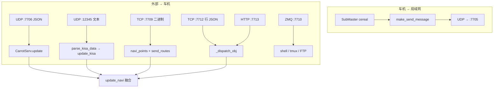

# CarrotPilot 服务代码逆向分析报告（按端口细化）

> **基于 2025-07 最新代码树**：`carrotcode/selfdrive/carrot/`

---

## 1. 模块职责概览

| 文件 | 类/功能 | 职责 |
|------|---------|------|
| `carrot_man.py` | `CarrotMan` | 网络主入口：UDP 7705/7706、TCP 7709/7711/7712、HTTP 7713、ZMQ 7710、路线融合、弯道速度、广播 |
| `carrot_serv.py` | `CarrotServ` | 核心导航数据处理：`update()` JSON 消费、`update_navi()` 车速控制、SDI/TBT 映射、GPS 融合 |
| `carrot_controls.py` | Carrot 控制 | openpilot 控制接口集成 |
| `carrot_functions.py` | 工具函数 | 通用辅助函数 |
| `carrot_learning.py` | 学习模块 | 驾驶行为学习 |
| `carrot_server.py` | Web 服务 | aiohttp 启动入口（端口 7000） |
| `xiaoge_data.py` | `XiaogeDataBroadcaster` | 7711 端口 小哥数据广播 |
| `server/` | aiohttp 后端 | 设置、参数、仪表盘、终端、屏幕录制等 Web API |
| `web/` | 前端 SPA | 单页 Web 应用（驾驶/设置/工具/日志/终端） |
| `realtime/` | 实时数据 | WebSocket 实时推送 cereal 消息 |
| `recovery/` | 恢复服务 | 端口 6999 独立恢复服务器 |

---

## 2. `CarrotMan` 进程与线程模型

`CarrotMan.__init__()` 启动以下守护线程：

| 线程 | 目标方法 | 端口/协议 | 频率 |
|------|---------|-----------|------|
| `carrot_zmq_thread` | `carrot_cmd_zmq` | ZMQ 7710 | 事件驱动 |
| `carrot_panda_debug_thread` | `carrot_panda_debug` | — | 每秒 |
| `carrot_route_thread` | `carrot_route` | TCP 7709 | recv 阻塞 |
| `broadcast_version_info` | `broadcast_version_info` | UDP 7705 (出站) | 20 Hz |

主线程运行 `carrot_man_thread()`：UDP 7706 recv 阻塞 → `CarrotServ.update()`。

---

## 3. 数据流总览（Mermaid）



---

## 4. 按端口的协议与字段（核心）

### 端口一览（本目录相关）

| 端口 | 协议 | 方向 | 消费代码 | 用途 |
|------|------|------|---------|------|
| 7705 | UDP | 出站 | `broadcast_version_info` | 车机状态广播给局域网 |
| 7706 | UDP | 入站 | `carrot_man_thread` → `update` | 手机导航 JSON |
| 7709 | TCP | 入站 | `carrot_route` | 路线折线（二进制） |
| 7710 | ZMQ | 入站 | `carrot_cmd_zmq` | 远程 shell 命令 |
| 7711 | TCP | 双向 | `xiaoge_data.py` | 小哥数据广播 |
| 7712 | TCP | 入站 | `_dispatch_obj` | 行 JSON（rgdata/vrtx/sinf） |
| 7713 | HTTP | 入站 | `_dispatch_obj` | POST JSON（同上） |
| 12345 | UDP | 入站 | `kisa_app_thread` | KISA/Waze 文本协议 |
| 7000 | HTTP | 双向 | `carrot_server.py` | 管理 Web UI |

### 4.1 UDP **7705** — 状态广播（出站）

**入口**：`broadcast_version_info`（约 20 Hz，Ratekeeper）

**消息来源**：`make_send_message()`

**内容格式**：JSON 字符串，包含：
- 车机状态（IP、连接状态）
- 导航状态（`navi_points_active`、路径点）
- 车速/限速信息

### 4.2 UDP **7706** — 手机 / 外部 → `CarrotServ.update`

**入口**：`carrot_man_thread`（约 501–525 行），`recvfrom 4096` → `json.loads`

**执行路径**：**`self.carrot_serv.update(json_obj)`**

#### 4.2.1 分支逻辑（必读）

`CarrotServ.update()` 的执行顺序（见 `代码分析.md → §1.1`）：

1. `carrotIndex` — 包序递增
2. 条件校时（每 60 包）
3. `carrotCmd` — 命令处理
4. `active_count = 80` — 刷新活动计时
5. `goalPosX/Y` — 目的地（需非 null）
6. **`nRoadLimitSpeed` 主导航块** — TBT/SDI/限速/GPS
7. `latitude` 手机 GPS 回退

#### 4.2.2 `nRoadLimitSpeed` 主块内字段 — 类型与 Python 侧变量

| JSON 键 | Python 类型 | Python 变量 | 备注 |
|---------|------------|-------------|------|
| `nRoadLimitSpeed` | int → 修正 | `nRoadLimitSpeed` | 见 §1.2 防抖/纠偏 |
| `nSdiType` | `_i(..., -1)` | `nSdiType` | |
| `nSdiSpeedLimit` | `_i(..., 0)` | `nSdiSpeedLimit` | |
| `nSdiDist` | `_i(..., -1)` | `nSdiDist` | |
| `nSdiBlockType` | `_i(..., -1)` | `nSdiBlockType` | |
| `nSdiBlockSpeed` | `_i(..., 0)` | `nSdiBlockSpeed` | |
| `nSdiBlockDist` | `_i(..., 0)` | `nSdiBlockDist` | |
| `nSdiPlusType` | `_i(..., -1)` | `nSdiPlusType` | |
| `nSdiPlusSpeedLimit` | `_i(..., 0)` | `nSdiPlusSpeedLimit` | |
| `nSdiPlusDist` | `_i(..., 0)` | `nSdiPlusDist` | |
| `nSdiPlusBlockType` | `_i(..., -1)` | `nSdiPlusBlockType` | |
| `nSdiPlusBlockSpeed` | `_i(..., 0)` | `nSdiPlusBlockSpeed` | |
| `nSdiPlusBlockDist` | `_i(..., 0)` | `nSdiPlusBlockDist` | |
| `roadcate` | `_i(..., 0)` | `roadcate` | |
| `nTBTDist` | int | `nTBTDist` | |
| `nTBTTurnType` | int | `nTBTTurnType` | |
| `szTBTMainText` | `_s` | `szTBTMainText` | |
| `szNearDirName` | `_s` | `szNearDirName` | |
| `szFarDirName` | `_s` | `szFarDirName` | |
| `nTBTNextRoadWidth` | int | `nTBTNextRoadWidth` | |
| `nTBTDistNext` | int | `nTBTDistNext` | |
| `nTBTTurnTypeNext` | int | `nTBTTurnTypeNext` | |
| `szTBTMainTextNext` | str | `szTBTMainTextNext` | **⚠️ Bug：读的是 `szTBTMainText`** |
| `nGoPosDist` | int | `nGoPosDist` | |
| `nGoPosTime` | int | `nGoPosTime` | |
| `szPosRoadName` | `_s`, 过滤 "null" | `szPosRoadName` | |
| `vpPosPointLat` | float | `vpPosPointLatNavi` | 条件覆写 `last_update_gps_time_navi` |
| `vpPosPointLon` | float | `vpPosPointLonNavi` | |
| `nPosAngle` | float | `nPosAngle` | 仅在 `vpPosPointLatNavi != 0.0` 时更新 |
| `nPosSpeed` | float | `nPosSpeed` | 无条件更新 |

#### 4.2.3 手机 GPS 块字段

| JSON 键 | Python 变量 | 条件 |
|---------|------------|------|
| `heading` | `nPosAnglePhone` | `_f(json.get("heading"), self.nPosAngle)` |
| `latitude` | `phone_latitude` | `_f`，缺省用 `vpPosPointLatNavi` |
| `longitude` | `phone_longitude` | `_f`，缺省用 `vpPosPointLonNavi` |
| `accuracy` | `phone_gps_accuracy` | `_f(..., 0)` |
| `gps_speed` | `nPosSpeed` | 仅当 navi 超时 3 秒 |

### 4.3 UDP **12345** — KISA / Waze 风格键值串

**入口**：`parse_kisa_data` → `update_kisa`

**格式**：`key:value/key:value`（`/` 分隔）

**支持键**（`update_kisa` 约 819–857 行）：
- `kisawazeroadspdlimit` → `xSpdLimit`
- `kisawazeroadname` → 显示
- `kisawazereportid` / `kisawazealertdist` → `xSpdType`
- 以及多项 KISA 标准键

**不走 `update`，独立影响 `xSpd*` 字段。**

### 4.4 TCP **7709** — 二进制点序列（`carrot_route`）

**格式**：
- 4 字节大端 uint32 → payload 长度
- payload：每点 8 字节（`!ff`）：经度(float32) + 纬度(float32)
- 前置 2 字节 uint16 = 点个数（冗余）

**结果**：`navi_points` + `send_routes()` + `params["NavDestination"]`

### 4.5 ZMQ **7710** — `carrot_cmd_zmq`

**用途**：接收 CPlink App 通过 ZMQ 发送的远程命令（shell、tmux、FTP）。  
**格式**：JSON 对象，含 `cmd`、`arg` 等。  
**注意**：此端口暂未被 App 侧的 `CarrotManNetworkClient.kt` 使用。

### 4.6 TCP **7712** + HTTP **7713** — `_dispatch_obj`

**公共入口**：
- 7712：`carrot_navi_tcp_server` — 每行 JSON 独立处理
- 7713：`carrot_http_post` — POST body 处理

**均调用** `_dispatch_obj(obj)`。

#### 4.6.1 顶层 JSON 对象（可多键并存）

| 键 | 处理函数 | 说明 |
|----|---------|------|
| `vrtx` | `handle_route(arr)` | 路线点数组 |
| `rgdata` | `handle_carrot_state(d)` → `update(d)` | 导航数据（同 7706 语义） |
| `sinf` | `handle_traffic_light(d)` | 红绿灯信息 |
| `timestamp_ms` | `_is_stale_rgdata` | 去重（仅 `rgdata` 同级） |

#### 4.6.2 `vrtx` 数组元素（`handle_route`）

| 字段 | 类型 | 必填 | 含义 |
|------|------|------|------|
| `valid` | boolean | 否 | 默认 `true`；`false` 则过滤掉 |
| `x` | number → float | 是 | **经度** |
| `y` | number → float | 是 | **纬度** |

空数组 → 清空路线、`navi_points_active=False`。

#### 4.6.3 `sinf` 对象（红绿灯 → `params_memory`）

红绿灯处理：
- 优先级：红 > 左 > 绿 > 右 > 掉头
- 输出：`params_memory["TrafficLight"]` = `{"distance":int, "lamp":"red"|"left"|"green"|"right"|"uturn", "remain":int}`

### 4.7 HTTP **7713** — aiohttp 导航 API

**端点**：
- `POST /navi` — `_dispatch_obj(await request.json())`
- `GET /health` — 健康检查 `{"status": "ok"}`

### 4.8 TCP **7711** — `XiaogeDataBroadcaster`（`xiaoge_data.py`）

- 车机 → App 数据流（车道线、驾驶模式等）
- App 仅发 4 字节心跳 `uint32 = 2`

---

## 5. 与其它模块的数据关系

| 车机模块 | 输入源 | 输出目标 |
|---------|--------|---------|
| `CarrotServ.update()` | 7706/7712/7713 `rgdata` | 内部状态字段 |
| `CarrotServ.update_navi()` | cereal `carState`/`selfdriveState` | `navInstruction` cereal 消息 |
| `CarrotServ.update_kisa()` | 12345 UDP | `xSpd*` 字段 |
| `CarrotMan.carrot_navi_route()` | `navi_points` + cereal `navRouteNavd` | `coords`/`distances` → `update_navi` |
| `CarrotMan._dispatch_obj()` | 7712 TCP / 7713 HTTP | `handle_route`/`handle_carrot_state`/`handle_traffic_light` |
| `CarrotMan.broadcast_version_info()` | 内部状态 | UDP 7705 广播 |

---

## 6. `turn_type_mapping` 双重定义（重要发现）

`carrot_serv.py` 中存在 **两个版本的 `turn_type_mapping`**：

### 6.1 模块级 `nav_type_mapping`（行 24–78）

```python
nav_type_mapping = {
  12: ("turn", "left", 1),
  ...
}
```

**用途**：`update_navi()` 中（行 1102–1107）将 `nTBTTurnType` 转换为 cereal `navInstruction` 的 `maneuverType`/`maneuverModifier`。

### 6.2 `_update_tbt()` 内的 `turn_type_mapping`（行 339–387）

```python
turn_type_mapping = {
  12: ("turn", "left", 1),
  ...
}
```

**用途**：`_update_tbt()` 中（约 390+ 行）将 `nTBTTurnType` 转换为 `xTurnInfo`（1左/2右/3左变道/4右变道/5环岛/6TG/7到达或掉头/8到达）。

### 6.3 两者的关键差异

| 值 | 模块级 `nav_type_mapping` | `_update_tbt.turn_type_mapping` | 影响 |
|----|--------------------------|-------------------------------|------|
| `14`（掉头） | `("turn", "uturn", 5)` | `("turn", "uturn", 7)` | cereal 用 5、`xTurnInfo` 用 7 |
| `201`（到达） | `("arrive", "straight", 5)` | `("arrive", "straight", 8)` | cereal 用 5、`xTurnInfo` 用 8 |
| `153/154/249`（TG） | `("", "", 6)` | `("", "", 6)` | 一致 |

**结论**：两个映射表**语义不同**，但定义重叠度高，维护时需同步修改。

---

## 7. CarrotServ `update()` 完整代码流（行 1182–1314）

```
update(json):
  1. 局部函数 _i/_f/_s
  2. carrotIndex ∈ json → self.carrotIndex
  3. 每 60 包 + epochTime → set_time()
  4. carrotCmd ∈ json → self.carrotCmd/Arg
  5. self.active_count = 80
  6. goalPosX ∈ json → goalPosX/Y (if both non-null)
  7. nRoadLimitSpeed ∈ json → 主导航块：
     a. nRoadLimitSpeed 纠偏/防抖
     b. nSdiType..nSdiPlusBlockDist (SDI+Plus)
     c. roadcate, nTBTDist..nTBTTurnTypeNext (TBT)
     d. szTBTMainTextNext ← json.get("szTBTMainText") ← 🐛 BUG
     e. nGoPosDist/Time, szPosRoadName (过滤"null")
     f. vpPosPointLatNavi, vpPosPointLonNavi
        → 条件覆盖 nPosAngle
     g. nPosSpeed ← 无条件 float
     h. _update_tbt() → xTurnInfo/xTurnInfoNext
     i. _update_sdi() → xSpdType/xSpdLimit/xSpdDist
  8. latitude ∈ json → 手机 GPS 块：
     a. nPosAnglePhone ← heading
     b. phone_lat/lon/accuracy
     c. 若 navi 超 3 秒 → 覆盖 vpPosPoint, nPosAngle, nPosSpeed
```

---

## 8. 安全与部署注意

- 所有端口默认绑定 `0.0.0.0`（全接口），**无认证/TLS**，仅限局域网使用。
- `carrot_cmd_zmq` 可执行任意 shell 命令（`exec_cmd`），**需加固**。
- HTTP 7713 POST `/navi` 可覆盖导航状态，生产环境应限 IP。
- `realtime/` WebSocket 暴露 cereal 消息，含车辆控制数据。

---

## 9. 其它端口速查（同目录）

| 文件 | 端口 | 协议 | 用途 |
|------|------|------|------|
| `carrot_server.py` | 7000 | HTTP/WS | Web 管理界面 |
| `recovery/server.py` | 6999 | HTTP | 恢复模式 Web 界面 |
| `server/live_runtime/broker.py` | — | WebSocket | 实时数据推送 |
| `server/features/ws.py` | — | WebSocket | cereal 消息实时订阅 |

---

## 10. 参考路径

| 路径 | 说明 |
|------|------|
| `carrotcode/selfdrive/carrot/carrot_man.py` | 网络入口主模块 |
| `carrotcode/selfdrive/carrot/carrot_serv.py` | 核心导航数据处理 |
| `carrotcode/selfdrive/carrot/xiaoge_data.py` | 7711 小哥广播 |
| `carrotcode/selfdrive/carrot/server/app.py` | Web 后端组合根 |
| `carrotcode/selfdrive/carrot/web/js/app.js` | Web 前端入口 |
| `carrotcode/selfdrive/carrot/web/js/realtime/` | 实时数据前端 |
| `carrotcode/selfdrive/carrot/web/js/pages/` | 各页面 JS |
