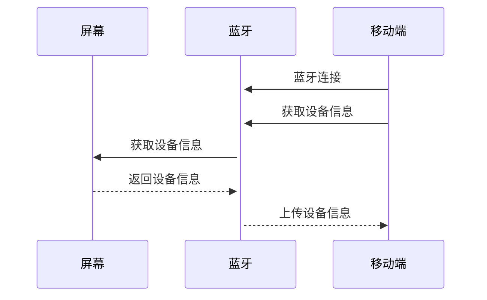

[返回](./uart.md#协议)

## 屏幕 <-> APP 透传协议

### 下行协议
- [显示开关](#显示开关)
- [亮度调节](#亮度调节)
- [播放控制](#播放控制)
- [节目编辑](#节目编辑)
- [实时显示](#实时显示)
- [资产下载](#资产下载)
- [OTA请求](./OTA.md#OTA请求)
- [实时显示请求](#实时显示请求)
- [节目列表请求](#节目列表请求)
- [资产请求](#资产请求)
- [设备信息请求](#设备信息请求)
- [设备状态控制](#设备状态控制)
- [设备参数控制](#设备参数控制)
- [设备系统控制](#设备系统控制)
- [设备鉴权](#设备鉴权)

### 上行协议
- [显示上传](#显示上传)
- [节目列表上传](#节目列表上传)
- [资产上传](#资产上传)
- [OTA反馈](./OTA.md#OTA反馈)
- [设备信息上传](#设备信息上传)
- [设备状态通知](#设备状态通知)
- [播放控制的内容上传](#播放控制的内容上传)

### 显示开关

控制屏幕显示的开关，当关闭时，屏幕以低功耗运行。

**协议内容**
| 序号 |       内容       |              备注              |
| :--- | :--------------- | :----------------------------- |
| 8~9  | `0x0E01`         | 16位命令 - 显示开关            |
| 10   | `0x00` or `0x01` | `0x00` = 关闭 `0x01` = 开启 |

### 亮度调节

控制屏幕显示的亮度

**协议内容**
| 序号 |      内容       |        备注         |
| :--- | :-------------- | :------------------ |
| 8~9  | `0x0E02`        | 16位命令 - 屏幕亮度 |
| 10   | `0x00` ~ `0xFF` | 8位亮度值           |

### 播放控制

当循环模式为`单个循环`时，播放指定节目组的指定节目。
当节目序号指定的节目在节目组中不存在时，播放节目组的第一个资产。  
当指定的节目组不存在或节目组中没有可播放的节目时，返回错误 `404`

**单个循环协议内容**
| 序号 |   内容   |              备注              |
| :--- | :------- | :----------------------------- |
| 8~9  | `0x0A01` | 16位命令 - 播放控制            |
| 10   | CMD      | `0x00` = 暂停 `0x01` = 播放
| 11   | 0 or 1   | `0x00` = 当前循环模式不变 `0x01` = 改变|
| 12   | LOOP     | `0x53` = 单个循环              |
| 13   | $A_{12}$ | 节目组序号                     |
| 14   | $A_{13}$ | 节目序号                       |

当循环模式为`全部循环`时，播放指定多个节目组中的全部节目。

**全部循环协议内容**
| 序号 |   内容   |              备注              |
| :--- | :------- | :----------------------------- |
| 8~9  | `0x0A01` | 16位命令 - 播放控制            |
| 10   | CMD      | `0x00` = 暂停 `0x01` = 播放 |
| 11   | LOOP     | `0x41` = 全部循环              |
| 12   | $A_{12}$ | 节目组序号                     |
| 13   | $A_{13}$ | 节目组序号                     |
| ...  | ...      | 以此类推                       |

当APP使用读取命令获取播放状态时，屏幕端使用上述相同协议格式返回。
**读取播放模式协议内容**
| 序号 |   内容   |        备注         |
| :--- | :------- | :------------------ |
| 8~9  | `0x0A01` | 16位命令 - 播放控制 |
| 10   | CMD      | `0xEA` = 读取播放参数|

- [上传播放模式协议内容定义](#播放控制的内容上传)

### 节目编辑

**协议内容**
|  序号   |   内容   |        备注         |
| :------ | :------- | :------------------ |
| 8~9     | `0xED01` | 16位命令 - 节目编辑 |
| 10      | `0`~`4`  | 节目组序号          |
| 11      | `0`~`11` | 节目序号            |
| 12      |          | 子元素数量          |
| 13 ~ n  |          | 子元素0             |
| n+1 ~ m |          | 子元素1             |
| ...     | ...      | 以此类推            |

节目组中未填充的节目子元素数量置为0。

### 实时显示

实时显示协议属于`长数据传输`，关于[长数据传输](./massdata.md)的流程请参考相关章节。

将指定内容在屏幕上实时展示

**协议内容**
| 序号  |   内容   |        备注         |
| :---- | :------- | :------------------ |
| 8~9   | `0xD501` | 16位命令 - 实时显示 |
| 10~13 | length   | 传输长度            |
| 14~15 | CUID     | 数据帧起始CUID      |

在涂鸦功能中，实时显示下发的内容为一个资产，描述整幅图片或者变化的内容。详见[实时显示增量更新](./diffimage.md)

### 实时显示(快速)

为了使得涂鸦界面能够实现低延迟的更新，新增单帧更新指令，使得数据可以仅通过一个蓝牙空中帧进行更新。

**全局颜色协议内容**  
全局颜色表示使用同一种颜色绘制本条数据中的所有点。
| 序号  |   内容   |            备注            |
| :---- | :------- | :------------------------- |
| 8~9   | `0xD507` | 实时显示快速更新(全局颜色) |
| 10~11 | COLOR    | 颜色                       |
| 12~13 | X0       | 像素0 X坐标                |
| 14~15 | Y0       | 像素0 Y坐标                |
| 16~17 | X1       | 像素1 X坐标                |
| 18~19 | Y1       | 像素1 Y坐标                |
| 20~n  |          | ...                        |

**像素着色协议内容**  
像素着色表示每个像素都有独立的颜色表示。
| 序号  |   内容   |            备注            |
| :---- | :------- | :------------------------- |
| 8~9   | `0xD508` | 实时显示快速更新(像素着色) |
| 10~11 | X0       | 像素0 X坐标                |
| 12~13 | Y0       | 像素0 Y坐标                |
| 14~15 | COLOR0   | 像素0 颜色                 |
| 16~17 | X1       | 像素1 X坐标                |
| 18~19 | Y1       | 像素1 Y坐标                |
| 20~21 | COLOR1   | 像素1 颜色                 |
| 22~n  |          | ...                        |

**实色填充协议内容**  
使用一种颜色填充一个区域。
| 序号  |   内容   |    备注     |
| :---- | :------- | :---------- |
| 8~9   | `0xD517` | 实色填充    |
| 10~11 | COLOR    | 颜色        |
| 12    | 形状     | `0x00`=矩形 |
| 13~14 | X        | X坐标       |
| 15~16 | Y        | Y坐标       |
| 17~18 | W        | 宽度        |
| 19~20 | H        | 高度        |

**实时律动同步**  
用于将 App 端的音乐或录音频谱数据实时同步至屏幕显示。

| 序号  |   内容   |            备注            |
| :---- | :------- | :------------------------- |
| 8~9   | `0xD518` | 16位命令 - 实时律动同步 |
| 10    | MODE     | 律动模式：`0x01`~`0x04` |
| 11    | RESERVED | 预留 (0x00) |
| 12~43 | BANDS[32]| 32 字节频段能量数据 (0~255) |

**BANDS 含义**  
`BANDS[0]` 表示低频能量，`BANDS[31]` 表示高频能量（从低到高递增）。设备端显示时可根据屏幕宽度将 32 段映射/插值到实际柱数；建议按列“从左到右”渲染。

**刷新频率建议**  
App 默认约 `25fps`（`40ms/帧`）发送。

### 资产下载

资产下载协议属于`长数据传输`，关于[长数据传输](./massdata.md)的流程请参考相关章节。

由移动端将资产内容传输至设备端

**协议内容**
| 序号  |   内容   |        备注         |
| :---- | :------- | :------------------ |
| 8~9   | `0xD001` | 16位命令 - 资产下载 |
| 10~13 | length   | 传输长度            |
| 14~15 | CUID     | 数据帧起始CUID      |
| 16~21 | UUID     | 资产指纹            |

当请求传输的资产指纹已经存在于本地时，返回错误 `429`  
当请求传输的数据长度超过本地剩余的储存容量时，返回错误 `413`

**整体传输流程** 
移动端下发0xD001资产下载请求帧 
终端完成合法性校验后，立即应答确认帧（ACK） 
移动端接收确认帧后，启动分包分页数据下发 
数据传输采用分页停等传输机制，固定传输规格：单帧有效载荷244 字节，单页承载500 帧数据 
移动端完成单页全部 500 帧数据下发后，暂停数据发送，阻塞等待终端页级应答帧 
移动端正常接收页级 ACK 应答，继续发起下一页数据传输；若接收异常或应答错误，对当前页面执行整页重传 
所有分页数据全部下发完毕，移动端接收终端末次完成应答帧后，主动结束本次资产下载会话 
**终端设备接收逻辑** 
终端应答下载请求后，进入数据监听接收状态 
接收过程严格校验帧序列号 CUID 连续性，若出现序列号断序、跳号等异常，立即停止数据接收并上报对应错误码，重置接收状态，等待移动端重传当前页面数据 
同一页面内连续接收满 500 帧合法有序数据，终端回复页级确认帧，准备接收下一页数据 
当累计接收数据总字节数与下载请求帧内约定总长度一致时，终端下发传输完成确认帧，告知移动端本次资产下载任务正常完结 
**链路保活与超时机制** 
终端接收0xD001下载请求后，若1 秒内未完成业务 ACK 应答，自动下发链路心跳帧维持通信链路 
移动端通信判定规则：若长时间未收到终端下发的心跳帧或各类业务应答帧，判定链路异常、设备离线 / 断电断连，主动终止本次资产下载任务，结束数据传输 

### 实时显示请求

**协议内容**
| 序号 |   内容   |        备注         |
| :--- | :------- | :------------------ |
| 8~9  | `0xD502` | 16位命令 - 实时显示 |
| 10   | CMD      | `0x00` = 获取       |

### 节目列表请求

**协议内容**
| 序号 |   内容   |        备注         |
| :--- | :------- | :------------------ |
| 8~9  | `0xD602` | 16位命令 - 节目列表 |
| 10   | CMD      | `0x00` = 获取       |

### 资产请求

**协议内容**
| 序号  |   内容   |        备注         |
| :---- | :------- | :------------------ |
| 8~9   | `0xD002` | 16位命令 - 资产上传 |
| 10    | CMD      | `0x00` = 获取       |
| 11~16 | UUID     | 资产指纹            |

### 设备信息请求

**协议内容**
| 序号 |   内容   |          备注           |
| :--- | :------- | :---------------------- |
| 8~9  | `0xD702` | 16位命令 - 设备信息请求 |
| 10   | CMD      | `0x00` = 获取           |

### 显示上传

将设备端中当前的显示内容上传至移动端，供移动端展示或编辑。如果当前显示内容为云端库内容，则上传指纹与帧编号；否则，上传原始图像。

**协议内容**
| 序号  |   内容   |           备注            |
| :---- | :------- | :------------------------ |
| 8~9   | `0xD502` | 16位命令 - 显示上传(指纹) |
| 10~15 | UUID     | 资产指纹                  |
| 16    |          | 帧序号                    |

显示上传协议中，上传原始图像的部分属于`长数据传输`，关于[长数据传输](./massdata.md)的流程请参考相关章节。

**协议内容**
| 序号  |   内容   |           备注            |
| :---- | :------- | :------------------------ |
| 8~9   | `0xD582` | 16位命令 - 显示上传(数据) |
| 10~13 | length   | 传输长度                  |
| 14~15 | CUID     | 数据帧起始CUID            |

### 节目列表上传

节目列表上传协议属于`长数据传输`，关于[长数据传输](./massdata.md)的流程请参考相关章节。

将设备端上的节目信息与其关联的资产指纹上传至移动端，若指纹包含在云端库中，则移动端直接从云端获取；若包含自定义资产指纹，则移动端自行按需请求相关资产。

**协议内容**
| 序号  |   内容   |          备注           |
| :---- | :------- | :---------------------- |
| 8~9   | `0xD602` | 16位命令 - 节目列表上传 |
| 10~13 | length   | 传输长度                |
| 14~15 | CUID     | 数据帧起始CUID          |

### 资产上传

资产上传协议属于`长数据传输`，关于[长数据传输](./massdata.md)的流程请参考相关章节。

由设备端将资产内容传输至移动端，仅用于上传不存在于云端的自定义资产

**协议内容**
| 序号  |   内容   |        备注         |
| :---- | :------- | :------------------ |
| 8~9   | `0xD002` | 16位命令 - 资产上传 |
| 10~13 | length   | 传输长度            |
| 14~15 | CUID     | 数据帧起始CUID      |
| 16~21 | UUID     | 资产指纹            |

### 设备信息上传

设备信息上传通常发生在蓝牙连接建立时，设备需要向移动端同步自身信息

**协议内容**
| 序号  |       内容       |                备注                |
| :---- | :--------------- | :--------------------------------- |
| 8~9   | `0xD702`         | 16位命令 - 设备信息上传            |
| 10~17 | string           | 屏幕型号                           |
| 18~25 | ID[8]            | 设备编号                           |
| 26~28 | version[3]       | 版本号                             |
| 29~30 | width            | 屏幕像素宽度                       |
| 31~32 | height           | 屏幕像素高度                       |
| 33    | `0`~`3`          | 屏幕方向 = $A_{33}\times90\degree$ |
| 34~37 | memory           | 屏幕储存容量                       |
| 38~41 | memory_avaliable | 屏幕储存可用容量                   |

### 设备状态控制

关于设备状态请参考 [设备状态机](./statemachine.md)

**设备状态码与参数**

| 状态码 | 状态名称 |              参数               |
| :----- | :------- | :------------------------------ |
| 0xFF   | 开机     | /                               |
| 0x01   | 节目播放 | 节目组[1] 节目[1] UUID[6] |
| 0x02   | 节目预览 | 正在播放的UUID[6]               |
| 0x03   | 涂鸦     | /                               |

**协议内容**
| 序号 |   内容   |              备注              |
| :--- | :------- | :----------------------------- |
| 8~9  | `0xC001` | 16位命令 - 设备状态控制        |
| 10   | CMD      | `0x00` = 获取 `0x01` = 设置 |
| 11   | STATE    | 状态码                         |
| 12~n |          | 状态参数                       |

当命令为获取时，无需提供后面的状态码与状态参数。

当命令为设置时，`节目播放`与`涂鸦`状态无需提供参数。

### 设备状态通知

**协议内容**
| 序号 |   内容   |          备注           |
| :--- | :------- | :---------------------- |
| 8~9  | `0xC081` | 16位命令 - 设备状态通知 |
| 10   | CMD      | `0x80` = 通知           |
| 11   | STATE    | 状态码                  |
| 12~n |          | 状态参数                |

**协议示例**
| 序号  |       内容       |     备注     |
| :---- | :--------------- | :----------- |
| 8~9   | `0xC081`         | 设备状态通知 |
| 10    | `0x80`           | 通知         |
| 11    | `0x01`           | 节目播放     |
| 12    | `0x02`           | 节目组2      |
| 13    | `0x01`           | 节目1        |
| 14~19 | `0xAABBCCDDEEFF` | 节目UUID     |

### 设备参数控制

设备参数数据结构同 [滚动动画T配置段](./assets_type/anime_text.md#配置段)

**设备参数**
| 参数类型 | 类型值 | 字节长度 |              内容              |
| :------- | :----: | :------: | :----------------------------- |
| 屏幕旋转 |  0x01  |    1     | $Value\times90\degree$         |
| 定时关机 |  0x02  |    2     | 倒计时分钟数，为0则取消        |
| 密码设置 |  0x03  |    N     | 密码字符串，长度为0时删除密码  |
| 屏幕开关 |  0x04  |    1     | 屏幕开关状态，0为关闭，非0为开 |
| 屏幕亮度 |  0x05  |    1     | 亮度设定值                     |

**协议内容**
| 序号 |   内容   |              备注              |
| :--- | :------- | :----------------------------- |
| 8~9  | `0xC002` | 16位命令 - 设备参数控制        |
| 10   | CMD      | `0x00` = 获取 `0x01` = 设置 |
| 11~n |          | 参数列表                       |

### 设备系统控制

**命令参数**
|   命令   |  值   |   内容    |
| :------- | :---: | :-------- |
| 重启     | 0xF1  | 屏幕重启  |
| 数据清理 | 0xF2  | 清空节目  |
| 格式化   | 0xFE  | 清空Flash |

**协议内容**
| 序号 |   内容   |          备注           |
| :--- | :------- | :---------------------- |
| 8~9  | `0xC055` | 16位命令 - 设备系统控制 |
| 10   | CMD      | `0x01` = 设置           |
| 11~n |          | 命令                    |

### 设备鉴权

**协议内容**
| 序号 |   内容   |        备注         |
| :--- | :------- | :------------------ |
| 8~9  | `0xC003` | 16位命令 - 设备鉴权 |
| 10   | CMD      | `0x01` = 密码校验   |
| 11~n |          | 密码字符串          |

> 如果设备设置了密码，在每次设备连接后，除本条协议外，其他通信均返回错误`401`

### 播放控制的内容上传

将设备端中当前的播放控制内容(包含当前播放节目和循环播放节目组数组)上传至移动端。

**协议内容**
|  序号   |          内容          |                      备注                       |
| :------ | :--------------------- | :---------------------------------------------- |
| 8~9     | `0x0A01`               | 16位命令 - 播放控制                             |
| 10      | playType               | 播放模式 `0x41` = 全部循环 `0x53` = 单个循环 |
| 11      | 0x00~0x04              | 当前正在播放的节目组下标                        |
| 12      | 0x00~0x11              | 当前正在播放的节目下标                          |
| 13~18   | 正在播放的UUID         | 6个byte                                         |
| 19      | N,全部循环的节目组个数 | N>=1 & N<=5                                     |
| 20~0x0N | 全部循环的节目组数组   |                                                 |

### 产线测试（`0x0F01`）

“产线测试”新指令（`0x0F01`）及参数枚举（红绿蓝白/行条/列条/格子）。
用于产线快速验证屏幕显示功能。移动端下发该指令后，屏幕端根据参数 TYPE 自动生成并显示对应测试画面（纯色/条纹/格子），便于检查坏点、亮度一致性、扫描异常等问题。

**协议内容**
| 序号 |       内容       |              备注              |
| :--- | :--------------- | :----------------------------- |
| 8~9  | `0x0F01`         | 16位命令 - 产线测试指令           |
| 10   | `0x00` ～ `0x12` | TYPE 枚举定义 |

**TYPE 枚举定义（1 byte）**
**纯色全屏（`0x00 ~ 0x07`）**

| TYPE   | 含义             |
| :----- | :--------------- |
| `0x00` | 红色全屏 Red     |
| `0x01` | 绿色全屏 Green   |
| `0x02` | 蓝色全屏 Blue    |
| `0x03` | 黄色全屏 Yellow  |
| `0x04` | 青色全屏 Cyan    |
| `0x05` | 紫色全屏 Magenta |
| `0x06` | 白色全屏 White   |
| `0x07` | 黑色全屏 Black   |

**图案（`0x10 ~ 0x12`）**
| TYPE   | 含义               |
| :----- | :----------------- |
| `0x10` | 行条纹（横向条纹） |
| `0x11` | 列条纹（纵向条纹） |
| `0x12` | 格子（横+纵组合）  |